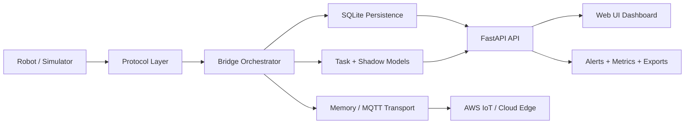

# Cloud Robot Command Center

<p align="center">
  
  
  
  
</p>

<p align="center">
  <strong>Developed and maintained by Ganesh Kumar Maddi</strong>
</p>

A full-stack, cloud-ready robot command and monitoring platform designed for local-first simulation, telemetry processing, operator control, and future AWS IoT / ROS 2 deployment. This project combines a resilient robot protocol layer, multi-robot dashboard, persistence, WebSocket updates, auth, event auditing, alerting, and deployment-oriented configuration into a single operational system.

## Table of contents

- [Overview](#overview)
- [Core capabilities](#core-capabilities)
- [Architecture](#architecture)
- [Project structure](#project-structure)
- [Quick start](#quick-start)
- [Run the dashboard](#run-the-dashboard)
- [Docker and deployment](#docker-and-deployment)
- [Authentication and security](#authentication-and-security)
- [Alerting and monitoring](#alerting-and-monitoring)
- [ROS 2 and AWS integration](#ros-2-and-aws-integration)
- [Testing and validation](#testing-and-validation)
- [Contributing and ownership](#contributing-and-ownership)

## Overview

This repository is an original implementation inspired by cloud-connected robot orchestration architectures, but it is not a direct copy of any external source code. It focuses on a practical, testable, and extensible control stack that can run locally for demos and be adapted to real cloud robotics environments.

The platform includes:

- robot telemetry ingestion and state tracking
- multi-robot fleet view and health scoring
- command issuance and task lifecycle management
- device shadow state for offline robot intent tracking
- persistent SQLite storage for operational history
- live updates through FastAPI WebSockets
- alert generation, audit events, and export/reporting APIs
- AWS IoT MQTT-ready transport boundaries for cloud connectivity

## Core capabilities

| Capability | Description |
| --- | --- |
| Protocol layer | Typed command and telemetry contracts with JSON serialization |
| Robot simulator | Deterministic robot behavior generation for demos and testing |
| Bridge layer | Orchestrates telemetry flows, command dispatch, and task state |
| Fleet dashboard | Real-time operator monitoring with map, health, metrics, and robot cards |
| Persistence | SQLite-backed telemetry, commands, events, and task retention |
| Auth | Token-based access control with configurable local login |
| Shadow model | Maintains desired state separate from reported robot state |
| Alerting | Severity-based alerts and optional webhook delivery |
| Reporting | JSON/CSV export and operational trend summaries |
| Deployment ready | Docker, Compose, and Kubernetes-oriented structure |

## Architecture



## Project structure

```text
cloud-robot-command-center/
├── src/
│   └── cloud_robot_bridge/
│       ├── api.py
│       ├── auth.py
│       ├── bridge.py
│       ├── config.py
│       ├── mqtt.py
│       ├── protocol.py
│       ├── shadow.py
│       ├── simulator.py
│       ├── tasks.py
│       └── transport.py
├── tests/
│   ├── test_api.py
│   ├── test_auth.py
│   └── test_config.py
├── deploy/
│   └── kubernetes.yaml
├── .env.example
├── .github/workflows/ci.yml
├── docker-compose.yml
├── pyproject.toml
├── README.md
└── LICENSE
```

## Quick start

Requires Python 3.10 or later.

```powershell
py -m venv .venv
.\.venv\Scripts\Activate.ps1
py -m pip install -e ".[dev]"
py -m pytest -q
py -m ruff check .
```

## Run the dashboard

Start a simulated robot stream:

```powershell
robot-simulator --robot-id demo-bot --count 20 --interval 0.25
```

Start the command center API and dashboard:

```powershell
robot-command-center --host 0.0.0.0 --port 8000
```

Then open:

```text
http://localhost:8000
```

## Docker and deployment

Run the full stack with Docker Compose:

```powershell
docker compose up --build
```

Sample Kubernetes deployment:

```bash
docker build -t cloud-robot-command-center:latest .
kubectl apply -f deploy/kubernetes.yaml
```

This repository includes health checks and deployment-oriented defaults to support local and cloud deployment workflows.

## Authentication and security

The command center supports local login with bearer token authentication.

Default credentials:

- username: `admin`
- password: `admin123`

Environment overrides:

- `COMMAND_CENTER_USERNAME`
- `COMMAND_CENTER_PASSWORD`
- `COMMAND_CENTER_ROLE`
- `COMMAND_CENTER_REQUIRE_AUTH`

Example:

```bash
export COMMAND_CENTER_REQUIRE_AUTH=true
export COMMAND_CENTER_USERNAME=admin
export COMMAND_CENTER_PASSWORD=your_secure_password
```

Protected endpoints require a valid `Authorization: Bearer <token>` header.

## Alerting and monitoring

The platform generates operational alerts for:

- low battery
- robot error states
- task anomalies
- health degradation

Optional external integration:

```bash
export COMMAND_CENTER_WEBHOOK_URL="https://example.com/alerts"
```

When configured, alert payloads are pushed as JSON to the webhook destination for downstream monitoring systems.

## ROS 2 and AWS integration

### ROS 2 adapter

On a ROS 2 Humble system:

```bash
colcon build --base-paths ros --packages-select mqtt_bridge
source install/setup.bash
ros2 run mqtt_bridge bridge_node
```

The adapter layer is designed to integrate pose data and bridge telemetry without coupling the core app to ROS-specific logic.

### AWS IoT transport

Copy the environment example and configure the connection:

```bash
cp .env.example .env
```

Set your AWS IoT endpoint and certificate paths, then use the MQTT transport in `cloud_robot_bridge.mqtt` to publish and subscribe to robot topics.

Topics follow a simple cloud-friendly pattern:

- `robot/{robot_id}/pub/monitoring/telemetry`
- `robot/{robot_id}/sub/command/#`

The transport abstraction keeps the rest of the project independent from AWS-specific logic.

## Testing and validation

This project is validated with automated tests and linting:

```powershell
py -m pytest -q
py -m ruff check .
```

The codebase includes tests for:

- API behavior and dashboard state
- auth token validation
- config loading and validation
- telemetry and command flow

## Contributing and ownership

This repository was created and developed as a personal project by Ganesh Kumar Maddi.

The project is intended as an original, practical demonstration of a cloud robot operations system with realistic architecture, operational patterns, and deployment readiness. It is not a direct code copy of any external repository and was built as a custom implementation from the ground up.

## License

This project is provided for learning, demonstration, and engineering exploration. Add an appropriate license if you plan to distribute or commercialize it.

