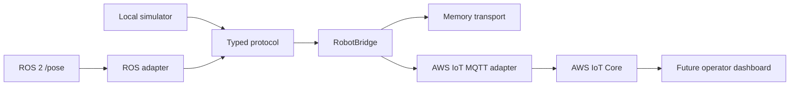

# Architecture

## Boundaries

`protocol.py` owns the wire format. `bridge.py` owns orchestration. `transport.py` defines the small interfaces that real MQTT and test transports implement. `simulator.py` is deliberately deterministic so demos and regression tests do not require physical hardware.

## Reliability rules

- Keep credentials in environment variables or mounted certificate files.
- Keep transport failures at the adapter boundary.
- Validate command identity with `action` and `request_id` before dispatch.
- Preserve timestamps in UTC ISO-8601 format.
- Add retries and offline shadow reconciliation in the AWS adapter rather than in the protocol model.
